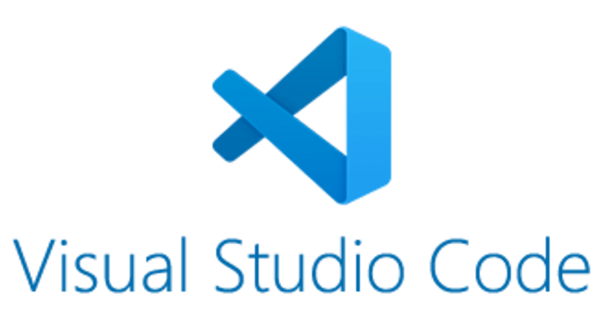

# Conceptos Técnicos Informáticos

## ℹ️ Descripción Genereal: 
Este repositorio almacena todos los archivos, códigos y evaluaciones de la asignatura de Conceptos Técnicos Informáticos del Centro de Formación Técnica de la región de Los Lagos, asignatura impartida por el profesor Marcelo Crisostomo.
Información correspondiente al segundo semestre del años 2024.

### 🧐 Estructura del Respositorio:

Este repositorio cuenta con carpetas que se detallan de la siguiente manera:


#### 📁 Carpetas:

- 📁Clase_1_Intrudción_Historia
- 📁Clase_2_Conceptos
- 📁Clase_3_Actividad
- 📁Clase_4_Creación_Repositorio
- 📁Clase_5_Ramas
- 📁Clase_6_Página_web


#### 👩🏽‍💻 Requisitos Previos:

Para hacer uso de este repositorio de manera online, los contenidos son subidos a la plataforma de github, en donde se van actualizando semana a semana.
Los archivos son actualizados a través del uso del programa llamado Visual Code, con la extención de Python. Para llevar a cabo este proceso se utilizan los siguientes códigos: 

1) git branch
2) git chechout origin master
3) git add .
4) git commit -m "..."
5) git push origin master

#### Los programas utilizados para este proceso son:

| Programa utilizado | Link del programa                 |
| ------------------ | ----------------------------------|
| Visual Code        | https://code.visualstudio.com/    |
| Python             | https://www.python.org/downloads/ |


#### 🧐 Clonación de este Respositorio:

Para clonar este repositorio debes contar con este código:

```sh
https://github.com/Loreto-Vivar/Repositorio-conceptos-tecnicos-informaticos.git
```

Rama del repositorio de programación:
```sh
8devmx/adding-readme-file
```


#### Imagen de referencia de Visual Code:



#### Imagen de referencia de Python:


